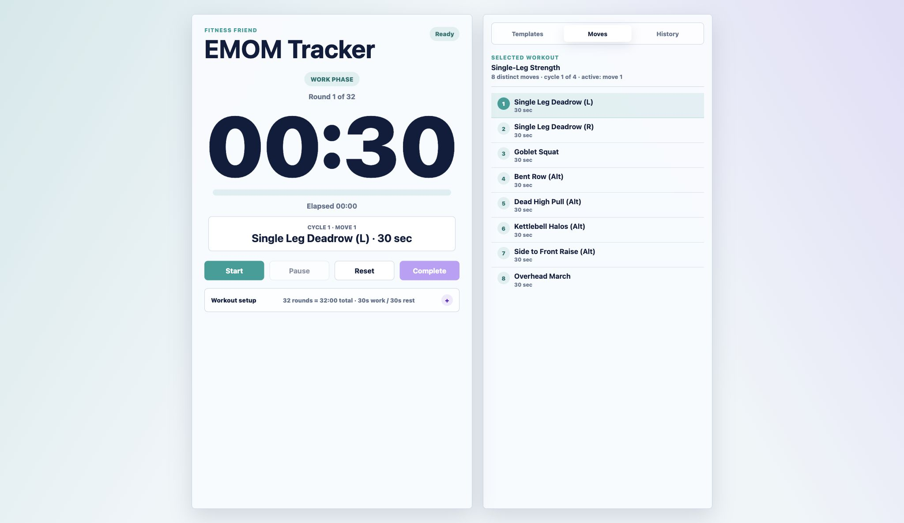

# BellForge

Equipment-aware strength training built around an EMOM timer.



In this app, one EMOM round is one minute total. By default, each minute is
30 seconds of active work and 30 seconds of rest, so 10 selected rounds creates
a 10-minute session. The work/rest seconds are configurable as long as they add
up to 60 seconds.

Workouts are seeded from `/Users/spencerguy/Downloads/2026 Home Workout Sheet.xlsx`.
Each workout repeats the logged movement list by its cycle count, then converts
that into one-minute EMOM rounds.

You can also create custom workouts in the Builder tab. Custom workouts are
saved locally in the browser and appear alongside the seeded workouts.

The Equipment tab stores selected workout gear in the browser. Bodyweight,
kettlebell, dumbbells, and barbell start selected, and custom gear can be added
for future workout planning.

The Plan tab adds a weekly planner and 12-week progress heatmap. Planned
sessions can be assigned from saved workouts, started from the plan, skipped,
cleared, and automatically marked complete when the planned workout finishes.

Workouts can be favorited with the star control. Favorited workouts sort to the
top of the list, and the four muscle-gain research workouts start favorited.

Workout visuals use a custom generated kettlebell movement sheet at
`assets/kettlebell-moves-01.png`. The app only shows an illustration when a
move has an explicit visual mapping; otherwise it shows a neutral placeholder
so unsupported moves do not display misleading art.

Additional kettlebell workouts were researched from Health, Woman & Home,
Fit&Well, and SELF guides covering full-body kettlebell circuits, beginner
fundamentals, mobility/core work, power/stability moves, and Turkish get-up
practice.

Hypertrophy-focused kettlebell programming notes and source links are saved in
`research/kettlebell-hypertrophy-2026-06-12.md`.

## Run it

```sh
python3 -m http.server 4173
```

Open `http://localhost:4173` for the BellForge landing page.

Open `http://localhost:4173/timer.html` for the EMOM timer app.

## Deploy it

This app is static, so it can be hosted on GitHub Pages. The workflow in
`.github/workflows/pages.yml` deploys the repository root whenever `main` is
pushed. In GitHub, set **Settings -> Pages -> Build and deployment** to
**GitHub Actions**.

After the first successful deploy, the site will be available at:

```text
https://zpencerguy.github.io/fitness-friend/
```

## Test it

```sh
node timer.test.js
```

## Backend API

Phase 1 backend scaffolding lives in `apps/api`.

```sh
npm run api:dev
npm run api:test
docker compose up --build
```

The API contract is in `apps/api/openapi.yaml`, and the initial Postgres schema
is in `apps/api/db/migrations/001_initial_schema.sql`.
When `DATABASE_URL` is set, the API uses the Postgres repository adapter;
otherwise it uses the in-memory repository for local prototyping and tests.

See `docs/backend-phase-1.md` for the current backend architecture notes.

The web app can optionally hydrate from and mirror writes to the API while
keeping browser-local storage as the default fallback. Start the API, then open
the timer with:

```text
http://localhost:4173/timer.html?apiBaseUrl=http://localhost:8080&userId=dev-user
```

Those values are saved in localStorage for later visits. Clear
`bellforge-api-base-url` to return to local-only mode.

## Current data model

Completed workouts are stored in the browser with IndexedDB under the original
local database name so existing browser data continues to load:

- Database: `fitness-friend`
- Store: `emomWorkouts`
- Store: `weeklyPlans`

Each completed EMOM saves:

- `name`
- `rounds`
- `tags`
- `completedAt`
- `durationSeconds`
- `plannedDurationSeconds`
- `workSecondsPerRound`
- `restSecondsPerRound`
- `equipment`
- `type`

Use the Export JSON button to download the current local workout history.
